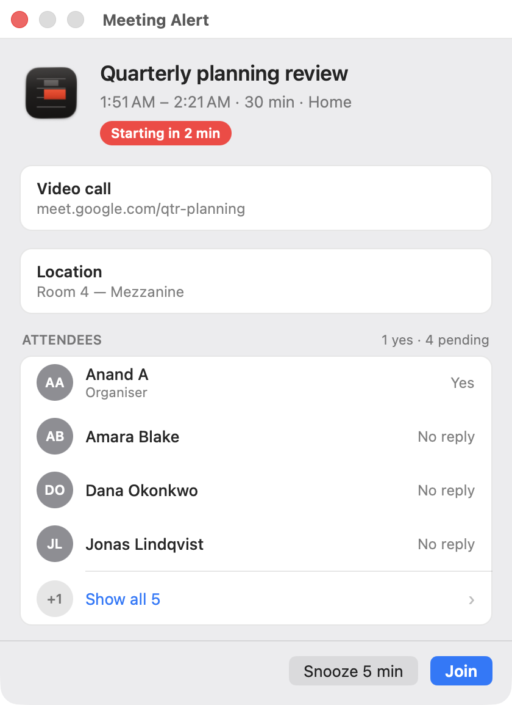

# Meeting Alerts

A lightweight macOS menu bar app that keeps your next meeting in front of you, and puts a
panel on screen shortly before it starts so you don't miss it.

<p align="center">
  
</p>

## Install

1. Download `MeetingAlerts.dmg` from the [latest release](https://github.com/and/meeting-alerts-mac/releases/latest)
2. Open it and drag **Meeting Alerts** into your **Applications** folder
3. Launch it from Applications — it must run from there, not from the disk image
4. Grant calendar access when prompted. On macOS 14 and later choose **Full Access**;
   read-only is not enough to read event details
5. Quit and relaunch once after granting access

The app is signed with a Developer ID certificate and notarized by Apple, so it opens
without a Gatekeeper warning. There is no Dock icon — it lives in the menu bar.

**Requires macOS 13 (Ventura) or later.** Universal: Apple Silicon and Intel.

## What it does

**In the menu bar**, your next meeting, in the format you choose:

| Format | Example |
| --- | --- |
| Time + title | `10:00 AM Design review (30m)` |
| Title only | `Design review` |
| Countdown + title | `in 15m Design review (30m)` |
| Countdown only | `in 15m` |

Once a meeting is under way it counts down instead: `10:00 AM Design review (15m left)`.
If a meeting is running and the next one starts within 30 minutes, the upcoming one takes
over, on the grounds that it is the one you still have to act on.

**Click the icon** for your next three meetings, Settings, Launch at Login, Refresh and
Quit. Clicking a meeting opens its video call if it has one. Launch at Login is on from
the first run — untick it there to stop the app starting with your Mac.

**Hover the text** for a tooltip with the full title, times, duration, participants and
the video link — useful when the title is too long for the menu bar.

## The alert panel

Three minutes before a meeting starts, a panel appears with everything you need to decide
what to do. It shows only what your calendar actually holds, so a bare meeting shows just
the header and the buttons.

- **Join** opens the video call. Press **Return** to trigger it without reaching for the
  mouse
- **Snooze** brings the panel back about a minute before the meeting starts, or in five
  minutes if it has already begun. The button states the real interval, so you always know
  what you are agreeing to
- **Attendees** lists the first four with their RSVP; **Show all** expands the rest

Each meeting alerts once. Dismissing it does not bring it back.

Zoom, Google Meet, Microsoft Teams and Webex links are detected from the event's URL field
or anywhere in its notes.

## Settings

Open **Settings…** from the menu bar icon.

1. **Display Format** — which of the four menu bar formats above to use
2. **Animation** — scroll long titles when you hover them. Off by default, so the menu bar
   stays still
3. **Meeting Alert** — **Press Return to join the meeting**. On by default. Turn it off if
   you would rather Return did nothing while the panel is focused

## Troubleshooting

**No meetings showing.** Check System Settings → Privacy & Security → Calendars. On macOS
14 and later the app needs **Full Access**; Write-Only cannot read your events. Restart the
app after changing it.

**The app vanished after you granted permission.** Expected on first launch. Start it
again and it will stay.

**Meetings look stale.** The app refreshes every 30 seconds, immediately when the calendar
changes, and on waking from sleep. If something still looks wrong, use **Refresh**, or quit
and reopen.

**Start over with permissions.**

```bash
tccutil reset Calendar com.meetingalerts.app
```

Then restart the app and grant access again. (The identifier does not match the app's name
for historical reasons — it is correct as written.)

## Good to know

- Only today's and tomorrow's meetings appear, and all-day events are skipped
- The menu bar text is capped at 8 characters; hover for the rest, or turn on scrolling
- Your calendar is never modified — the app only reads it
- Nothing leaves your Mac. No servers, no analytics, no network calls of any kind

## Development

Building, the release pipeline, architecture and notarization are documented in
[DEVELOPMENT.md](DEVELOPMENT.md).

## License

Copyright 2025. All rights reserved.
